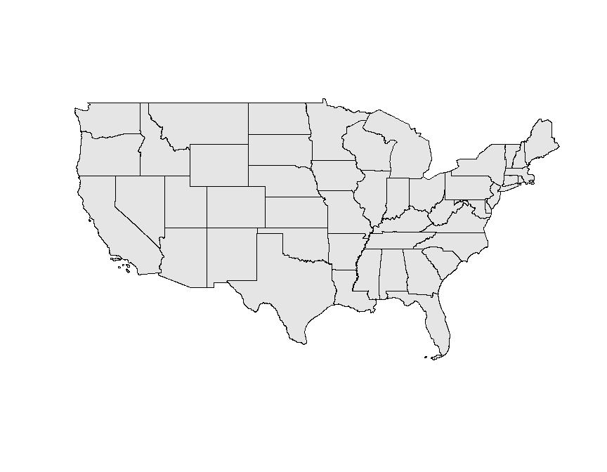

# Visualization, Spatial Cognition for crime map in New Haven, CT, using R
Zhaohu(Jonathan) Fan  


# Basic mapping-crime map

There are many different options for mapping, but we are going to focus on *GIStools*, which depends on several packages, including *maptools*, *rgdal*, and *sp*.


Plotting once these packages (*sp* in particular) are loaded is pretty straightforward; R now knows how to deal with these data types.

Let's make a quick crime map


```r
# head(blocks) # This is a MESS
head(data.frame(blocks))  # Coerce to dataframe first
```

```
##   NEWH075H_ NEWH075H_I HSE_UNITS OCCUPIED VACANT  P_VACANT P_OWNEROCC
## 0         2         69       763      725     38  4.980341   0.393185
## 1         3         72       510      480     30  5.882353  20.392157
## 2         4         64       389      362     27  6.940874  57.840617
## 3         5         68       429      397     32  7.459207  19.813520
## 4         6         67       443      385     58 13.092551  80.361174
## 5         7        133       588      548     40  6.802721  52.551020
##   P_RENTROCC NEWH075P_ NEWH075P_I POP1990  P_MALES P_FEMALES   P_WHITE
## 0  94.626474         2        380    2396 40.02504  59.97496  7.095159
## 1  73.725490         3        385    3071 39.07522  60.92478 87.105177
## 2  35.218509         4        394     996 47.38956  52.61044 32.931727
## 3  72.727273         5        399    1336 42.66467  57.33533 11.452096
## 4   6.546275         6        404     915 46.22951  53.77049 73.442623
## 5  40.646259         7        406    1318 50.91047  49.08953 87.784522
##     P_BLACK P_AMERI_ES P_ASIAN_PI  P_OTHER  P_UNDER5    P_5_13  P_14_17
## 0 87.020033   0.584307   0.041736 5.258765 12.813022 24.707846 7.888147
## 1 10.452621   0.195376   0.521003 1.725822  1.921198  2.474764 0.814067
## 2 66.265060   0.100402   0.200803 0.502008 10.441767 13.554217 5.722892
## 3 85.553892   0.523952   0.523952 1.946108 10.853293 17.739521 7.709581
## 4 24.371585   0.327869   1.420765 0.437158  6.229508  8.633880 2.950820
## 5  7.435508   0.758725   0.834598 3.186646  8.725341  8.194234 3.641882
##     P_18_24   P_25_34   P_35_44  P_45_54  P_55_64   P_65_74   P_75_UP
## 0 12.479132 16.026711  8.555927 5.759599 4.924875  4.048414  2.796327
## 1 71.149463  7.359166  4.037773 1.595571 1.758385  3.712146  5.177467
## 2  8.835341 17.670683 17.871486 8.734940 5.923695  7.931727  3.313253
## 3 12.425150 18.113772 10.853293 9.056886 6.287425  4.266467  2.694611
## 4  7.103825 17.267760 16.830601 8.415301 7.431694 14.426230 10.710383
## 5 10.091047 29.286798 12.898331 7.814871 7.814871  6.904401  4.628225
```

```r
plot(blocks, lwd = 0.5, col = "darkseagreen1", border = "white")  # Plot the 'lowest' first.
plot(roads, add = TRUE, col = "slategray3")  # Roads on top
plot(breach, pch = 17, add = TRUE, col = add.alpha("#EE2C2C", 0.7))  # Add transparency
```

<!-- -->

The *Locator* function lets you interact directly with the plot. You click within the plot, and it returns the coordinates of where you clicked. This is a reasonable way to get the coordinates when you are placing things like legends within the plot.


```r
# locator() # Get Coordinates (commented for markdown)
plot(blocks, lwd = 0.5, col = "cornsilk", border = "antiquewhite2")
plot(roads, add = TRUE, col = "slategray3") 
plot(breach, pch = 20, add = TRUE, col ="red")

# Add a scale bar, if you're into that
map.scale(xc = 540000, yc = 152000, # Position on map, in map units
          len = miles2ft(2), # Length in feet (2 * 5,280)
          units = "Miles", 
          ndivs = 4, 
          subdiv = 0.5)

#locator() # Click once on location, then hit finish button in plot window OR use the Esc key

# North arrow
north.arrow(xb = 540000, yb = 157000, 
            len = miles2ft(.2), # Length of base
            col = "gray60",
            border = "gray30",
            tcol = "gray60") # Color

title(main = 'New Haven, CT.') # Title

title(main = "Crime Infested Wasteland", # Informative subtitle
      line = -.2, # Move down
      col.main = "red3",
      font.main = 4, # Bold italic
      cex.main = 1) # make a little smaller
```

<!-- -->

#Choropleth Maps
This is essentially a basic reference map, but we can also use the attribute data within the spatial classes to make thematic maps, such as choropleth maps. There are many ways to create choropleth maps, including a whole friggin' package called *choroplethr*, but let's use *GISTools* for consistency, which has some functions specifically for that. Let's make two maps with the data we have: percent vacant and percent owner occupied.


```r
# head(data.frame(blocks)) # Look at our data again

colnames(data.frame(blocks)) # Just the attribute names
```

```
##  [1] "NEWH075H_"  "NEWH075H_I" "HSE_UNITS"  "OCCUPIED"   "VACANT"    
##  [6] "P_VACANT"   "P_OWNEROCC" "P_RENTROCC" "NEWH075P_"  "NEWH075P_I"
## [11] "POP1990"    "P_MALES"    "P_FEMALES"  "P_WHITE"    "P_BLACK"   
## [16] "P_AMERI_ES" "P_ASIAN_PI" "P_OTHER"    "P_UNDER5"   "P_5_13"    
## [21] "P_14_17"    "P_18_24"    "P_25_34"    "P_35_44"    "P_45_54"   
## [26] "P_55_64"    "P_65_74"    "P_75_UP"
```

```r
blocks$P_VACANT[1:5] # Can be treated like a dataframe... sometimes  
```

```
## [1]  4.980341  5.882353  6.940874  7.459207 13.092551
```

```r
# hist(blocks$P_VACANT) #Same for graphing
display.brewer.pal(5, "Blues")
```

<!-- -->

```r
# auto.shading builds off of color brewer to create classes
# Needs to be stored separately
shades.blue  <-  auto.shading(blocks$P_VACANT, cols = brewer.pal(7,'Blues')[3:7]) #Create a new color palette

shades.blue # Note class breaks
```

```
## $breaks
##  20%  40%  60%  80% 
##  5.4  7.6 10.0 13.0 
## 
## $cols
## [1] "#9ECAE1" "#6BAED6" "#4292C6" "#2171B5" "#084594"
## 
## attr(,"class")
## [1] "shading"
```

```r
# ?auto.shading # Part of GIStools

choropleth(blocks, 
           v = blocks$P_VACANT, # Variable to be mapped
           shading = shades.blue, # Shading object created above
           bg = "gray30", # Background color
           border = NA # No Border
           ) 

plot(blocks,
     add = TRUE,
     col=NA, 
     border = add.alpha("#FFFFFF", .2) # partly transparent white
     )

# choropleth maps attributes held in SpatialPolygons DataFrame (e.g., 'blocks')
choro.legend(px = 533000, py = 161000, 
             sh = shades.blue,
             border = "#FFFFFF80", # Semitransparent white around boxes
             bg = NA, # No background color,
             bty = "n", # No outer box
             text.col = "red", # Broken apparently
             title.col = "white"
             )

title(main = "Percent Vacant",
      col.main = "gray20")
```

<!-- -->

```r
# Create new set of shades for Owner occupied percentage
shades.yell  <-  auto.shading(blocks$P_OWNEROCC,cols=brewer.pal(5,'YlOrRd')) #Create a new color palette

choropleth(blocks, blocks$P_OWNEROCC, 
           shading = shades.yell, # Shading object created above
           bg = "gray30", # Background color
           border = NA # No Border
           ) 
           
plot(blocks,
     add = TRUE,
     col=NA, 
     border = add.alpha("#000000", .15) # partly transparent black
     )

choro.legend(px = 533000, py = 161000, 
             sh = shades.yell,
             border = NA,
             bg = NA, # No background color,
             bty = "n" # No outer box
             )
# Add title
title(main = "Percent Owner Occupied",
      col.main = "gray20")
```

<!-- -->

Now, what would be even more interesting to put these side by side. Note that color choice is important, so these would probably work better with swapped palettes, since red is usually associated with 'negative' variables.


```r
o.par <- par(no.readonly = FALSE)

# Put them side by side, adjust margins
par(mfrow = c(1, 2), mar = c(1, 0, 1, 0))  # mar =bottom, left, top, right

# Vacant Map
choropleth(blocks, v = blocks$P_VACANT, shading = shades.blue, bg = "gray30", 
    border = NA)
plot(blocks, add = TRUE, col = NA, border = add.alpha("#FFFFFF", 0.2))
choro.legend(px = 533000, py = 161000, sh = shades.blue, border = "#FFFFFF80", 
    bg = NA, bty = "n", text.col = "red", title.col = "white")
title(main = "Percent Vacant", col.main = "white", line = -1)

# Owner Occupied Map
choropleth(blocks, blocks$P_OWNEROCC, shading = shades.yell, bg = "gray30", 
    border = NA)
plot(blocks, add = TRUE, col = NA, border = "gray15")  # Alpha not working on second plot??
choro.legend(px = 533000, py = 161000, sh = shades.yell, border = NA, bg = NA, 
    bty = "n")
title(main = "Percent Owner Occupied", col.main = "white", line = -1)
```

<!-- -->

```r
par(o.par)
```

# Raster in a Minute

Let us delve into the world of rasters. A type of raster can be created using just input points called a kernel density raster, which can be used to visualize relationships, but is prone to manipulation and can become misleading very quickly.


```
## SpatialPoints:
##          Long      Lat
## [1,] 551419.5 181266.3
## [2,] 556319.5 177580.7
## [3,] 551423.1 172304.5
## [4,] 550261.9 182613.2
## [5,] 555168.5 172163.4
## [6,] 549133.6 169623.6
## Coordinate Reference System (CRS) arguments: +proj=lcc
## +datum=NAD27 +lon_0=-72d45 +lat_1=41d52 +lat_2=41d12 +lat_0=40d50
## +x_0=182880.3657607315 +y_0=0 +units=us-ft +no_defs +ellps=clrk66
## +nadgrids=@conus,@alaska,@ntv2_0.gsb,@ntv1_can.dat
```

```
## [1] "SpatialPixelsDataFrame"
## attr(,"package")
## [1] "sp"
```

```
##            kde     Var1   Var2
## 1 6.538740e-35 531731.9 147854
## 2 9.770069e-35 531922.3 147854
## 3 1.448876e-34 532112.7 147854
## 4 2.132528e-34 532303.2 147854
## 5 3.115218e-34 532493.6 147854
## 6 4.516606e-34 532684.0 147854
```

```
##            kde     Var1     Var2
## 1 2.722636e-13 531731.9 188464.6
## 2 3.455488e-13 531922.3 188464.6
## 3 4.357233e-13 532112.7 188464.6
## 4 5.459338e-13 532303.2 188464.6
## 5 6.797505e-13 532493.6 188464.6
## 6 8.411979e-13 532684.0 188464.6
```

<!-- -->
So this is a raster "heatmap" of where breaches of the peace happen, but it doesn't have any context.

It would be nice if we could have a strong outline for the city, with lighter internal divisions, and not show anything outside the city. First, we need to create a masking polygon, then create an outline polygon, and then add the blocks, but with transparency.

<!-- -->
-------------------

# Importing Shapefiles

Here we will import a shapefile with attribute data using *rgdal*, subset it to the area we want using attributes and a clipping polygon (with the *GISTools* package), and make a couple simple maps. 

Available spatial data often comes in the nearly-universal shapefile format (.shp), but R by default isn't able to process shapefiles.

As with everything else, you need the right package. There are several options, including *rgdal*, *maptools*, and *PBSmapping* (more information [here](https://www.nceas.ucsb.edu/scicomp/usecases/ReadWriteESRIShapeFiles))

While most of this tutorial relies on *GISTools*, which itself depends on several other spatial packages including *maptools*, *rgdal* is probably the most straightforward way as it automagically gets the projection information if provided in the shapefile.

The shapefile we will be using is from the [US Census](https://www.census.gov/geo/maps-data/data/tiger.html), and contains a significant amount of demographic attributes. Our particular data (Demographic Profile 1 of states) is hosted [here](http://www2.census.gov/geo/tiger/TIGER2010DP1/State_2010Census_DP1.zip).

First, some setup:


Now to actually use *readOGR*


```
## OGR data source with driver: ESRI Shapefile 
## Source: "D:/One_Geo/VisualizationTutorial/State_2010Census_DP1", layer: "State_2010Census_DP1"
## with 52 features
## It has 195 fields
```

Of course, once it's in there, it's useful to take a look at it in a couple different ways. First:


```r
class(murica)  # What is this thing?
```

```
## [1] "SpatialPolygonsDataFrame"
## attr(,"package")
## [1] "sp"
```

Note that the type of data is *SpatialPolygonsDataFrame*, which means there is geometry (SpatialPolgyons), and attributes (DataFrame). This is important since these can be manipulated separately. For example, you can treat it like a regular data frame.


```
## NULL
```

```
## [1] "GEOID10"    "STUSPS10"   "NAME10"     "ALAND10"    "AWATER10"  
## [6] "INTPTLAT10" "INTPTLON10" "DP0010001"
```

```
## [1] "data"        "polygons"    "plotOrder"   "bbox"        "proj4string"
```

```
##  [1] Wyoming              Pennsylvania         Ohio                
##  [4] New Mexico           Maryland             Rhode Island        
##  [7] Oregon               Puerto Rico          Wisconsin           
## [10] North Dakota         Nevada               Georgia             
## [13] New York             Arkansas             Kansas              
## [16] Nebraska             Utah                 Alaska              
## [19] Mississippi          Oklahoma             West Virginia       
## [22] Michigan             Colorado             New Jersey          
## [25] Delaware             Montana              Washington          
## [28] Connecticut          California           Kentucky            
## [31] Massachusetts        Florida              Idaho               
## [34] Missouri             Hawaii               Alabama             
## [37] South Carolina       New Hampshire        South Dakota        
## [40] Illinois             Tennessee            Indiana             
## [43] Iowa                 Arizona              Minnesota           
## [46] Louisiana            District of Columbia Virginia            
## [49] Texas                Vermont              Maine               
## [52] North Carolina      
## 52 Levels: Alabama Alaska Arizona Arkansas California ... Wyoming
```

```
## [1] New Mexico
## 52 Levels: Alabama Alaska Arizona Arkansas California ... Wyoming
```

```
## CRS arguments:
##  +proj=longlat +datum=NAD83 +no_defs +ellps=GRS80 +towgs84=0,0,0
```

```
## [1] "+proj=longlat +datum=NAD83 +no_defs +ellps=GRS80 +towgs84=0,0,0"
```
-------------------

# Subsetting and Clipping Data

We can go ahead and clip out the continental US for a more convenient mapping set. This is a common workflow, since often you are dealing with an area of interest (AOI) that does not align with all of your data. There are two ways to get the continental US: spatially, and by attribute. First, we will use the attributes to subset the desired states. Second, we will use a spatial clip and then we will subset using attributes in the data.


## Subsetting using Attributes

Subsetting by attribute is much easier than a spatial clip, so let's start with that. We can create an array of booleans that we can use to subset the SpatialPolygonsDataFrame based off the name of the states and territories we don't want. These are Alaska, Hawaii, and Puerto Rico.

Note the use of logical operators (tips [here](http://www.statmethods.net/management/operators.html)). Super beginner stuff: Here, **!=** is "is not", and **&** is "and", so this reads more or less *"is this state name not Alaska, not Hawaii, and not Puerto Rico?"*


```
## [1] Wyoming      Pennsylvania Ohio         New Mexico   Maryland    
## [6] Rhode Island
## 52 Levels: Alabama Alaska Arizona Arkansas California ... Wyoming
```

```
##  [1]  TRUE  TRUE  TRUE  TRUE  TRUE  TRUE  TRUE FALSE  TRUE  TRUE  TRUE
## [12]  TRUE  TRUE  TRUE  TRUE  TRUE  TRUE FALSE  TRUE  TRUE  TRUE  TRUE
## [23]  TRUE  TRUE  TRUE  TRUE  TRUE  TRUE  TRUE  TRUE  TRUE  TRUE  TRUE
## [34]  TRUE FALSE  TRUE  TRUE  TRUE  TRUE  TRUE  TRUE  TRUE  TRUE  TRUE
## [45]  TRUE  TRUE  TRUE  TRUE  TRUE  TRUE  TRUE  TRUE
```

<!-- --><!-- -->


## Subsetting by Spatial Clip

This method is very much more involved, but necessary for true spatial subsetting, where geometry (i.e., polygons) are required, like clipping national data to a state boundary. 

The first step in a spatial clip is getting a clipping polygon, which we will define manually here, but often this another existing area such as a administrative boundary.

Creating a spatial polygon takes a few steps...


```
##              xx       yy
## [1,] -125.85075 23.44079
## [2,] -129.45032 52.25642
## [3,]  -57.45885 51.61607
## [4,]  -58.35875 22.80044
```

<!-- -->
Clipping strips SpatialPolygonDataFrames of their attributes, which means you need a mechanism to restore those attributes. Long story short, but you can maintain the IDs of the features, and use those to re-join the dataframe back to the SpatialPolygon. This is easier if the clipping feature is also a SpatialPolygonDataFrame.


```r
temp.df <- data.frame(value = 1, row.names = ID)  # Create simple DF to add to SpatialPolgyon

clip.spdf <- SpatialPolygonsDataFrame(clip.raw, temp.df)  # Merge the SpatialPolygon and temp.df to make SpatialPolygonDataFrame

class(clip.spdf)  #Check that it is the correct class (SpatialPolygonDataFrame) and has data included
```

```
## [1] "SpatialPolygonsDataFrame"
## attr(,"package")
## [1] "sp"
```

Finally, we are now ready for the actual clip.

<!-- -->

```
## [1] "SpatialPolygons"
## attr(,"package")
## [1] "sp"
```

As you can see, the clip worked but there is no data. Unfortunately, there is no completely straightforward way of doing a clip on a SpatialDataFrame. 

What you have to do is subset get an array of the maintained polgyons and use that to subset the original dataframe, then re-join that dataframe to our new SpatialPolygons.

First, we need the array that tells us which polygons we kept. This is saved in the ID of the polygons (since we clipped with **byid =TRUE**), which is a little tricky to access.


```
## [1] "clip 0"
```

```
##  [1] "clip 0"  "clip 1"  "clip 2"  "clip 3"  "clip 4"  "clip 5"  "clip 6" 
##  [8] "clip 8"  "clip 9"  "clip 10" "clip 11" "clip 12" "clip 13" "clip 14"
## [15] "clip 15" "clip 16" "clip 18" "clip 19" "clip 20" "clip 21" "clip 22"
## [22] "clip 23" "clip 24" "clip 25" "clip 26" "clip 27" "clip 28" "clip 29"
## [29] "clip 30" "clip 31" "clip 32" "clip 33" "clip 35" "clip 36" "clip 37"
## [36] "clip 38" "clip 39" "clip 40" "clip 41" "clip 42" "clip 43" "clip 44"
## [43] "clip 45" "clip 46" "clip 47" "clip 48" "clip 49" "clip 50" "clip 51"
```

```
##       [,1]   [,2]
##  [1,] "clip" "0" 
##  [2,] "clip" "1" 
##  [3,] "clip" "2" 
##  [4,] "clip" "3" 
##  [5,] "clip" "4" 
##  [6,] "clip" "5" 
##  [7,] "clip" "6" 
##  [8,] "clip" "8" 
##  [9,] "clip" "9" 
## [10,] "clip" "10"
## [11,] "clip" "11"
## [12,] "clip" "12"
## [13,] "clip" "13"
## [14,] "clip" "14"
## [15,] "clip" "15"
## [16,] "clip" "16"
## [17,] "clip" "18"
## [18,] "clip" "19"
## [19,] "clip" "20"
## [20,] "clip" "21"
## [21,] "clip" "22"
## [22,] "clip" "23"
## [23,] "clip" "24"
## [24,] "clip" "25"
## [25,] "clip" "26"
## [26,] "clip" "27"
## [27,] "clip" "28"
## [28,] "clip" "29"
## [29,] "clip" "30"
## [30,] "clip" "31"
## [31,] "clip" "32"
## [32,] "clip" "33"
## [33,] "clip" "35"
## [34,] "clip" "36"
## [35,] "clip" "37"
## [36,] "clip" "38"
## [37,] "clip" "39"
## [38,] "clip" "40"
## [39,] "clip" "41"
## [40,] "clip" "42"
## [41,] "clip" "43"
## [42,] "clip" "44"
## [43,] "clip" "45"
## [44,] "clip" "46"
## [45,] "clip" "47"
## [46,] "clip" "48"
## [47,] "clip" "49"
## [48,] "clip" "50"
## [49,] "clip" "51"
```

```
##  [1]  0  1  2  3  4  5  6  8  9 10 11 12 13 14 15 16 18 19 20 21 22 23 24
## [24] 25 26 27 28 29 30 31 32 33 35 36 37 38 39 40 41 42 43 44 45 46 47 48
## [47] 49 50 51
```

Now we can actually subset the data from the original *murica* dataset and combine it with the SpatialPolygon


```
##   GEOID10 STUSPS10       NAME10      ALAND10    AWATER10  INTPTLAT10
## 0      56       WY      Wyoming 251470069067  1864445306 +42.9918024
## 1      42       PA Pennsylvania 115883064314  3397122731 +40.9042486
## 2      39       OH         Ohio 105828706692 10269012119 +40.4149297
## 3      35       NM   New Mexico 314160748240   756659673 +34.4391265
## 4      24       MD     Maryland  25141638381  6989579585 +38.9466584
## 5      44       RI Rhode Island   2677566454  1323668539 +41.5978358
##     INTPTLON10 DP0010001
## 0 -107.5419255    563626
## 1 -077.8280624  12702379
## 2 -082.7119975  11536504
## 3 -106.1261511   2059179
## 4 -076.6744939   5773552
## 5 -071.5252895   1052567
```

```
## [1] 52
```

```
## [1] 49
```

Finally, we can smash that data back into a SpatialPolgygons**DataFrame** using the function... that is, uh, also named that.


```r
murica.spdf.2 <- SpatialPolygonsDataFrame(real.murica.sp, data = murica.data, 
    match.ID = FALSE)  # Create SpatialPolygonDataFrame

class(murica.spdf.2)  # Check results - Note the object type
```

```
## [1] "SpatialPolygonsDataFrame"
## attr(,"package")
## [1] "sp"
```

```r
slotNames(murica.spdf.2)  #Check results - Note the Data slot
```

```
## [1] "data"        "polygons"    "plotOrder"   "bbox"        "proj4string"
```

```r
plot(murica.spdf.2, col = "gray90")  # Plot that thang
```

<!-- -->

## Some Maps 

Awesome, we now have the real 'Murica ready to go. We can now use the census data to make a couple informative maps. The most obvious is choropleth maps. Choropleth maps should not be used to map *totals*, but instead should be used to map proportions, since the various sizes of features can mislead readers. So, to map population, let's roll with population density. Note that the rather obtuse names for the fields are explained in an .xls file that came in the same .zip as the shapefile.


```
## [1] 251470069067 115883064314 105828706692 314160748240  25141638381
## [6]   2677566454
```

```
## [1]  97092.594  44742.451  40860.464 121297.465   9707.187   1033.808
```

```
## [1] 121297.5
```

```
## [1] 2059179
```

```
## [1]    5.805036  283.899936  282.339038   16.976274  594.770890 1018.145134
```

Now to get mapping... first, we need to create a color scheme, then we can use the choropleth function in GISTools to quickly make a choropleth map.

<!-- -->

Legends are an art unto themselves, but lots of aesthetic options are available through the various parameters listed [here](https://www.rdocumentation.org/packages/graphics/versions/3.3.2/topics/legend?).

# Reprojecting

You may have noticed that the top of the continental US is straight, which depending on how picky you are looks awful. This is a result of the map projection used, and is something that can be changed. This is the sort of thing that is easy to code, but actually requires a lot of domain knowledge. Map projections are complicated beasts, and it's often best to use something established, such as what your source data uses. You can also Google the best projections for your particular area of interest.

Once you know the name or class of projection you need, then what? Like everything else, you need the right format.

Typically projection information in R is contained with proj4strings (PROJ.4 strings), which are seemingly structured to confuse and deceive, but often something like an EPSG code is referenced elsewhere. Fortunately, these can be translated. Let's say you have a totally sick heads up on a dope map projection for the continental US called US National Atlas Equal Area, and you have the EPSG code, which is 2163.


```
##   code                                               note
## 1 3819                                           # HD1909
## 2 3821                                            # TWD67
## 3 3824                                            # TWD97
## 4 3889                                             # IGRS
## 5 3906                                         # MGI 1901
## 6 4001 # Unknown datum based upon the Airy 1830 ellipsoid
##                                                                                            prj4
## 1 +proj=longlat +ellps=bessel +towgs84=595.48,121.69,515.35,4.115,-2.9383,0.853,-3.408 +no_defs
## 2                                                         +proj=longlat +ellps=aust_SA +no_defs
## 3                                    +proj=longlat +ellps=GRS80 +towgs84=0,0,0,0,0,0,0 +no_defs
## 4                                    +proj=longlat +ellps=GRS80 +towgs84=0,0,0,0,0,0,0 +no_defs
## 5                            +proj=longlat +ellps=bessel +towgs84=682,-203,480,0,0,0,0 +no_defs
## 6                                                            +proj=longlat +ellps=airy +no_defs
```

```
## [1] "+proj=laea +lat_0=45 +lon_0=-100 +x_0=0 +y_0=0 +a=6370997 +b=6370997 +units=m +no_defs"
```

Of course, you can naturally look this up all online, which is what (spatialreference.org)[http://spatialreference.org/] is for. You can search for projections, and pull the PROJ.4 string directly. Here is the page for the example above: (US National Atlas Equal Area)[http://spatialreference.org/ref/epsg/2163/].


```r
murica.lambert <- spTransform(murica.spdf, CRS(lambert.ea))  # CRS interfaces with PROJ.4 and parses the projection for spTransform
# summary(murica.lambert)
plot(murica.lambert)  # Oooh pretty curve!
```

<!-- -->

Okay, now to just re-do our previous map with our reprojected data.

<!-- -->

### Reference
#### This section is adapted from the book (An Introduction to R for Spatial Analysis and Mapping)[https://www.amazon.com/Introduction-Spatial-Analysis-Mapping/dp/1446272958].
